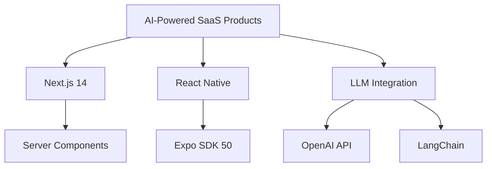

<div align="center">
  
</div>

<h3 align="center">🔥 Turning Complex Problems Into Scalable Solutions Since 2017 🔥</h3>

<p align="center">
  <a href="https://calendly.com/asif88383/30min" target="_blank">
    
  </a>
</p>

<!-- GitHub Stats Rainbow Border -->
<div align="center" style="border: 5px solid transparent; border-image: linear-gradient(to bottom right, #00FF87 0%, #60EFFF 25%, #536DFE 50%, #FF4081 75%, #FFC107 100%); border-image-slice: 1; padding: 20px; border-radius: 15px; margin: 20px 0;">
  
  <p align="center">
     •
     •
     •
    
  </p>

  <!-- GitHub Trophies with Animation -->
  <div align="center">
    <a href="https://github.com/ryo-ma/github-profile-trophy">
      
    </a>
  </div>
</div>

## 🚀 **WHY WORK WITH ME?** 

```diff
+ ✅ 7+ Years Full Stack Development Experience
+ 🏆 200+ Projects Delivered Successfully
+ 💡 AI/ML Integration Specialist
+ 🚀 2x Faster Delivery Than Industry Standard
+ 🌍 Worked With Clients From 15+ Countries
```

## 🔥 **CURRENTLY WORKING ON**



## 🛠️ **TECH STACK** 

<details>
  <summary><b>✨ Click to See My Full Arsenal ✨</b></summary>
  
  ### **Frontend**
  
  
  
  
  ### **Mobile**
  
  
  
  ### **AI/ML**
  
  
  
  ### **Backend**
  
  
  
  ### **DevOps**
  
  
</details>

## 📈 **GITHUB STATS** 

<div align="center">
  
  
  
</div>

## 🏆 **FEATURED PROJECTS** 

| Project                                                                       | Description                                          | Tech Stack                  | Live Demo                             |
| ----------------------------------------------------------------------------- | ---------------------------------------------------- | --------------------------- | ------------------------------------- |
| **[AI Girlfriend](https://github.com/asiflhr/ai-girlfriend)** | AI-powered virtual girlfriend | HTML, CSS, Gemini  | [Demo](https://ai-girlfriend-sigma-jet.vercel.app/) |
| **[Snapgram - Social media](https://github.com/asiflhr/snapgram-react-vite-appwrite-tailwind-reactQuery)**       | Instagram like social media                  | React, Tailwind, Appwrite | [Demo](https://snapvite.vercel.app/)          |
| **[Zentry - Clone](https://github.com/asiflhr/zentry-clone-react-tailwind-gsap)** | Zentry - Clone - Modern Animations                       | Next.js, Tailwind, GSAP     | [Demo](https://zentry-gsap.vercel.app/)       |

## 💼 **CLIENT SUCCESS STORIES** 

> "Muhammad delivered our AI-powered mobile app 2 weeks ahead of schedule with exceptional quality. The app increased our customer engagement by 65%!"  
> **— CEO, TechStart Inc.** [★ ★ ★ ★ ★]

> "His React expertise transformed our web platform, increasing conversions by 40%. The clean codebase made future enhancements effortless."  
> **— CTO, DigitalSolutions** [★ ★ ★ ★ ★]

> "The AI integration he implemented saved us 20 hours/week in manual work. Truly transformative!"  
> **— Product Manager, AI Ventures** [★ ★ ★ ★ ★]

## 📫 **LET'S BUILD SOMETHING AMAZING** 

<p align="center">
  <a href="mailto:asif88383@gmail.com">
    
  </a>
  <a href="https://wa.me/923177051128">
    
  </a>
  <a href="https://www.linkedin.com/in/asiflhr/">
    
  </a>
  <a href="https://twitter.com/asiflhr">
    
  </a>
</p>

## 🎯 **READY TO START YOUR PROJECT?** 

<div align="center">
  <a href="https://calendly.com/asif88383/30min" target="_blank">
    
  </a>
</div>

<!-- Snake Game Contribution Grid -->
<div align="center">
  
</div>
